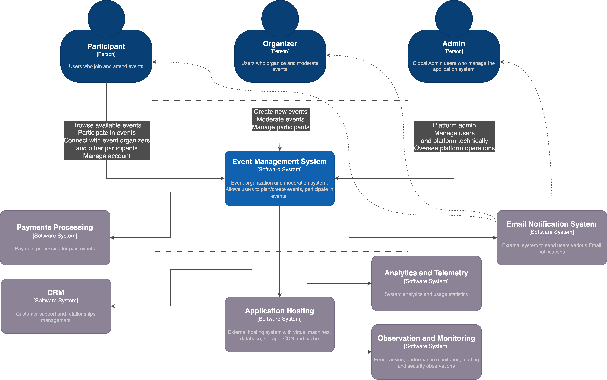

# Architecture Overview

## Introduction

Event Radar is an all-in-one event management platform, allowing users to create, manage, and participate in events.
The system is designed with scalability and modularity in mind, leveraging external cloud services to handle key
functionalities such as hosting, payments, and notifications.

This document provides a high-level overview of the system's architecture, based on the C4 model's Context diagram.
Future sections will include more detailed diagrams such as C4 Container and Component diagrams.

To understand different concepts and entities, check this [High-level entities description](../user_guide/entities.md).

## C4 Context

## System Context

### Users and Roles

A single user can assume multiple roles simultaneously.

- **Participant**: Users who join and attend events.
- **Organizer**: Users who organize and moderate events, conferences.
- **Admin**: Platform administrators who manage users and oversee platform operations.

### Core System

- The Event Management System is responsible for managing events, users, and interactions.
- It allows users to create, join, and participate in events, and handles all event-related operations.
- Platform admins can perform tasks such as system configuration, high-level moderation, auditing, etc.
  This role is intended for internal users only.

### External Systems and Tools

Various external services will be utilized to provide scalable features such as payment processing, email notifications,
customer relationship management, telemetry, and system monitoring.

- **Payments Processing System**: Handles payment processing for paid events.
- **Email Notification System**: Sends scalable email notifications to users (e.g., event updates, confirmations).
- **Application Hosting System**: External cloud infrastructure for virtual machines, databases, caching, storage,
  and CDN to ensure high-availability hosting.
- **CRM System**: Professional CRM tool for end-to-end customer relationship management and support.
- **Analytics and Telemetry System**: Collects platform usage statistics to improve features.
- **Observation and Monitoring System**: Tracks errors, performance, and alerts,
  ensuring continuous system health monitoring.
- **Security**: Specialized services and tools to monitor and resolve security vulnerabilities.
  Future sections will include details about these tools.

The overall design will be aimed to provide a common interface for all functions, allowing easy integration
with various external services of our choice.

## System Interactions

### Participant

- **Browse and join events**: Participants can browse available events, connect with organizers and other participants,
  and manage their accounts.
- **Receive notifications**: Participants receive email notifications for event updates, confirmations, and reminders.

### Organizer

- **Create and manage events**: Organizers can perform actions such as creating new events, moderating them,
  and managing participants.
- **Payments**: For paid events, organizers can manage payment processing through the Payments Gateway.

### Admin

- **Manage users and platform**: Admins oversee platform operations, manage users, and handle system-level tasks.

## External Interactions

### Payments Processing System

Handles payment processing for paid events. Interacts with the Event Management System to process payments
via API requests.

### Email Notification System

Sends various notifications, such as event confirmations and updates, via email to participants and organizers.

## Next Steps

The next stages of this architecture document will include:

- **Container Diagram**: Detailing the internal structure of the Event Management System, web app, mobile app,
  and backend API.
- **Component Diagram**: Breaking down the core components of the system to describe the interactions
  between various modules and services.

This architecture will evolve as we move forward with the implementation of each part of the system.
