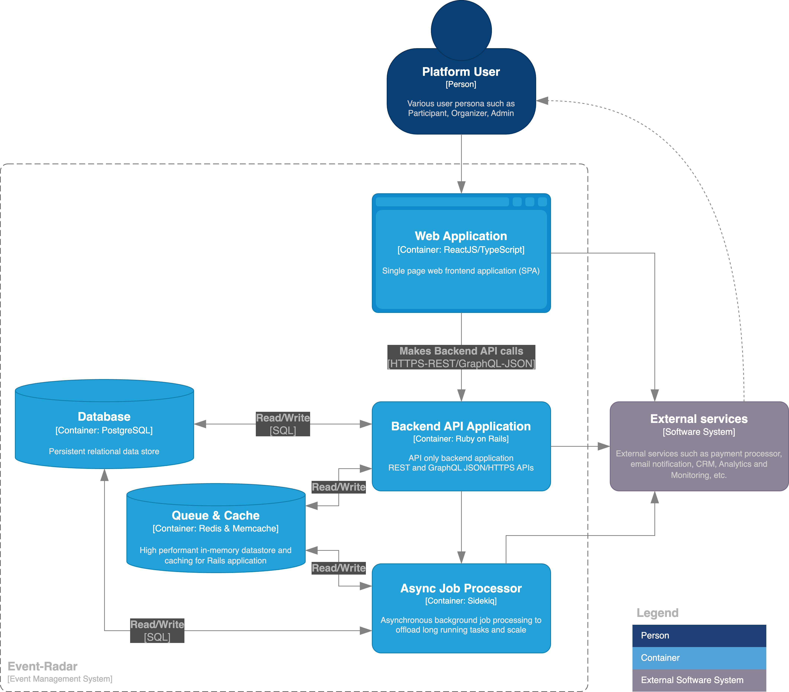

# Architecture Overview

Event Radar is an all-in-one event management platform, allowing users to create, manage, and participate in events.
The system is designed with scalability and modularity in mind, leveraging external cloud services to handle key
functionalities such as hosting, payments, and notifications.

This document provides a high-level overview of the system's architecture, based on the [C4 model](https://c4model.com/).

To understand different concepts and entities, check this [High-level entities description](../user_guide/entities.md).

## C4 Context

### System Context

#### Users and Roles

A single user can assume multiple roles simultaneously.

- **Participant** Users who join and attend events.
- **Organizer** Users who organize and moderate events, conferences.
- **Admin** Platform administrators who manage users and oversee platform operations.

Participant and Organizer roles are intentionally kept separate to provide flexibility for future scenarios
where event organization may be restricted to certain groups (e.g. premium users or verified organizers).

#### Core System

- The Event Management System is responsible for managing events, users, and interactions.
- It allows users to create, join, and participate in events, and handles all event-related operations.
- Platform admins can perform tasks such as system configuration, high-level moderation, auditing, etc.
  This role is intended for internal users only.
- Platform admins can perform tasks such as system configuration, high-level moderation, auditing, etc.
  This role is primarily intended for internal users only.

#### External Systems and Tools

Various external services will be utilized to provide scalable features such as payment processing, email notifications,
customer relationship management, telemetry, and system monitoring.

- **Payments Processing System** Handles payment processing for paid events.
- **Email Notification System** Sends scalable email notifications to users (e.g., event updates, confirmations).
- **Application Hosting System** External cloud infrastructure for virtual machines, databases, caching, storage,
  and CDN to ensure high-availability hosting.
- **CRM System** Professional CRM tool for end-to-end customer relationship management and support.
- **Analytics and Telemetry System** Collects platform usage statistics to improve features.
- **Observation and Monitoring System** Tracks errors, performance, and alerts,
  ensuring continuous system health monitoring.
- **Security** Specialized services and tools to monitor, resolve security vulnerabilities,
  and perform regular audits to ensure continuous security improvements.
  Future sections will include more details about these tools.

The overall design will be aimed to provide a common interface for all functions, allowing easy integration
with various external services of our choice.

### System Interactions

#### Participant

- **Browse and join events** Participants can browse available events, connect with organizers and other participants,
  and manage their accounts.
- **Receive notifications** Participants receive email notifications for event updates, confirmations, and reminders.

#### Organizer

- **Create and manage events** Organizers can perform actions such as creating new events, moderating them,
  and managing participants.
- **Payments** For paid events, organizers can manage payment processing through the Payments Gateway.

#### Admin

- **Manage users and platform** Admins oversee platform operations, manage users, and handle system-level tasks.

### External Interactions

#### Payments Processing System

Handles payment processing for paid events. Interacts with the Event Management System to process payments
via API requests.

#### Email Notification System

Sends various notifications, such as event confirmations and updates, via email to participants and organizers.

## C4 Container

This platform is designed using a monolithic architecture, ensuring scalability, modularity, and ease of maintenance.
Each container can be deployed independently or as part of a clustered system behind a load balancer
to improve performance as needed.

Below are the key containers that make up the system.

### Web Application (React/TypeScript)

Main user frontend, providing a user-friendly interface for participants, organizers, and admins alike.
It is a Single Page Application (SPA) built using standard [React](https://react.dev/)
and [TypeScript](https://www.typescriptlang.org/).

The web application communicates with API only Backend Application to make requests using JSON APIs.
All user interactions, such as event browsing, registrations, and management, are handled via this frontend.

- **Static Hosting** The React-based frontend SPA can be hosted using static hosting services,
  allowing near-instantaneous scaling and edge-caching. This helps to minimize latency for users worldwide.

- **Asset Optimization** Asset preloading, compression (e.g., Brotli or Gzip), and server-side caching
  are recommended to improve load times and reduce overall network bandwidth usage.
  Many of these optimization are already configured using Vite
  on the [frontend application](https://github.com/abhiyaantrix/event-radar-web).

- **Lazy Loading Assets** Frontend assets should be lazy-loaded, ensuring that users only download
  what they need when they need it, reducing the initial page load time.

### Backend API Application (Ruby on Rails)

Backend API Application serves as the core of the platform, handling all business logic, data processing,
and communication with the database and external services. It is built as an API-only Ruby on Rails application.

- Serves both the Web Application and external services. But not limited to,
  it can also be used by a mobile application later.

- It implements both REST and (future) GraphQL endpoints to handle requests from the frontend
  and facilitate interactions with various external systems like payments, notifications, and monitoring tools, etc.

- It communicates with the Database (PostgreSQL) for data persistence
- Redis and Memcache are utilized for Queue and Cache for performance optimization and reduced latency.

- **Horizontal Scaling with Load Balancing** The API-only backend can easily scale horizontally behind a load balancer.
  Managed platforms such as Heroku enable this automatically, while more advanced setups can leverage Kubernetes
  or other serverless platforms.

- **Microservice Future-Proofing** While the current design uses a monolithic approach for simplicity,
  it’s future-proofed to support a transition into microservices if certain features
  (e.g., payments, notifications) need to be scaled independently.

- **Rate Limiting** Implementing rate-limiting mechanisms via API Gateway or reverse proxies
  (e.g., Nginx) can protect the system from abuse and ensure availability for all users.
  Single application sever level rate limiting is already in place using
  [rack-attack gem](https://github.com/rack/rack-attack).

- **API Security** The API will enforce security protocols such as OAuth and JWT for authentication and authorization
  to ensure secure communication between the frontend and backend, and with external services.

### Async Job Processor (Sidekiq)

Asynchronous job processing offloads long-running tasks like sending emails or processing payments,
keeping the backend API responsive and free for other requests.

The Backend API Application enqueues jobs to [Sidekiq](https://github.com/sidekiq/sidekiq)
for asynchronous processing, and Sidekiq interacts with Redis to manage the job queue and store intermediate results.

- **Sidekiq and Redis Scaling** Sidekiq workers can scale independently from the backend to manage increased job
  processing loads. Redis, being a high-performance in-memory store, is also scalable through managed Redis services.

- **Asynchronous Task Distribution** Sidekiq provides native support for job prioritization and queue distribution,
  allowing background tasks (like emails and payments) to be processed with appropriate priority.

### Database (PostgreSQL)

PostgreSQL database acts as the persistent data store for the platform. Scaling strategies include,

- **Fully Managed Cloud Databases** Use managed services like AWS RDS or GCP Cloud SQL with auto-scaling and
  leader-follower replication for availability and scalability.

- **Connection Pooling** Implement connection pooling between the database and the backend application for better
  resource usage during traffic spikes, enabled natively by Rails’ ActiveRecord.

- **Read Replicas** To distribute the read load, recommend using read replicas for reporting and read-heavy operations,
  reducing the stress on the primary database.

- **Horizontal Scaling and Sharding** If traffic grows significantly, horizontal scaling via sharding or partitioning
  will ensure performance and lower latency, though this is beyond the initial scope of the project.

- **Fault Tolerance** Follower databases should be configured to automatically promote themselves to leader
  in case of failure, ensuring uptime and reliability.

- **Clustering** For advanced scalability, multi-leader (master) clusters can be introduced to distribute
  write operations across several nodes, ensuring high availability and reducing write bottlenecks.
  These advanced strategies are optional and can be implemented as the platform scales.

However, these advanced optimizations are out of scope at this stage of this project.
At the most basic level at least a simpler leader-follower database setup should be created.

### Queue & Cache (Redis/Memcached)

This container serves as the high-performance in-memory datastore and caching layer,
optimizing performance by reducing direct database hits for frequently accessed data.

- **Redis as Primary Queue** Redis is highly suitable for both caching and job queuing in this architecture.
  Scaling Redis horizontally through cluster-based deployment will ensure job processing speed and cache efficiency,
  even under high load.

- **Memcached for Static Data** Memcached should handle read-heavy static data (like configuration and session data)
  efficiently. Here as well a fully managed service should be used that generally offer horizontally scalable and
  replicated cache.

- **CDN for Static Content** To further reduce load on backend services, static assets (e.g., images, scripts)
  can be served via a CDN, improving load times and reducing latency globally.

### External Services

External services provide additional functionality such as payment processing, email notifications,
CRM, monitoring and alerting, security and vulnerability checks.

The Backend API Application interacts with external services via APIs to handle operations
like payment transactions, checkout experience for e-commerce, user communications (email),
and monitoring for performance or error tracking.

### Key Communication Flows

- **Frontend to Backend** The Web Application communicates with the Backend API to retrieve and manage data.
  All interactions between the frontend and backend are secured via HTTPS,
  with data being exchanged in REST/GraphQL/JSON format.

- **Backend to Database** The Backend API uses ActiveRecord to interact with database for all data persistence needs.

- **Backend to External Services** The Backend connects to external services
  such as payment processors (e.g., Stripe) using the platform specific API solutions including webhooks.

- **Backend to Asynchronous Processing** The Async Job Processor (Sidekiq) is used to handle tasks
  that are time-consuming to be processed synchronously, such as sending large batches of emails or processing payments.
  This frees up our main backend application to serve requests at increased uninterrupted capacity.

## Next Steps

The next stages of this architecture document will include

- **Mobile Application** While I do not plan to build a mobile application in the current implementation,
  a mobile app could easily integrate with this architecture by connecting to the same Backend API
  as the Web Application.

- **Component Diagram** Breaking down the core components of the system to describe the interactions
  between various modules and services.

- **Security and Advanced Configurations**: Future sections will outline security considerations,
  such as OAuth/JWT for authentication and API security, rate limiting, CORS,
  and infrastructure hardening using various tools like GitHub Advanced Security, [Grafana K6](https://k6.io/),
  and [OWASP ZAP](https://www.zaproxy.org/).
  Continuous security monitoring and regular updates will also be critical to ensure platform integrity.

This architecture will evolve as we move forward with the implementation of each part of the system.
